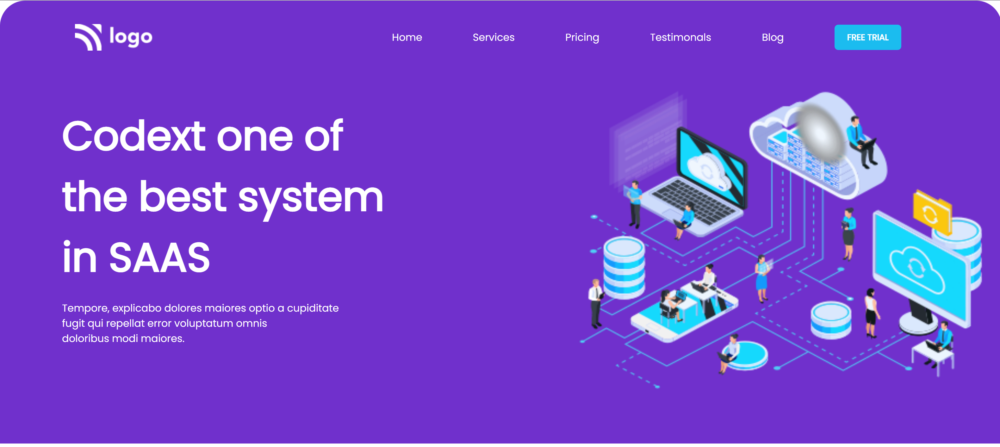
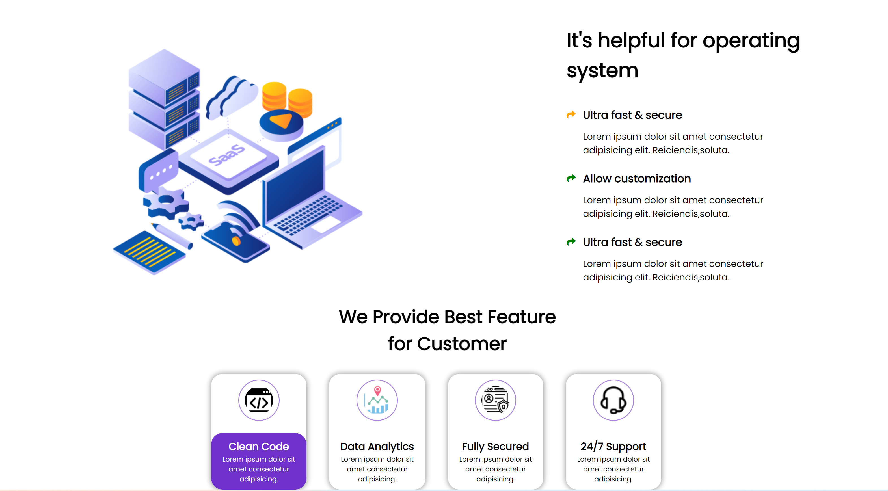

# This project Built With
#### 1.HTML
#### 2.CSS

## Acknowledgements
This landing page, took me almost 3 hrs to complete,this is my project 13 in fullstack development course by ineuron.in.

### During this project I've learned:

1.How to make navigation bar and hero section.
2.How layout webpage.
3.How to make two divs close to each other.
4.How to postion element using CSS position properties.

## Here is screen shot of project13.

## Here is screen shot of responsive view:

## Here is live link
[Live link](https://rohini-project-13.netlify.app/)

